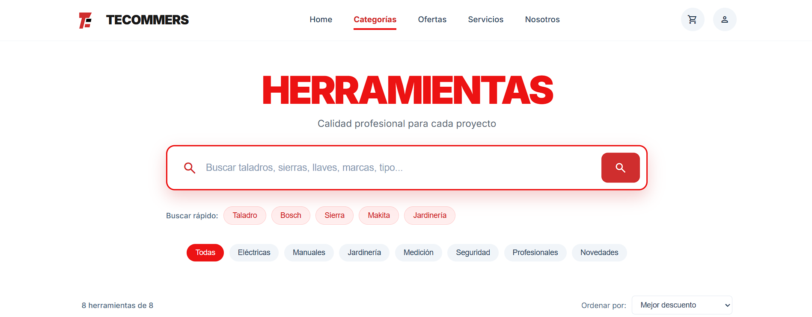
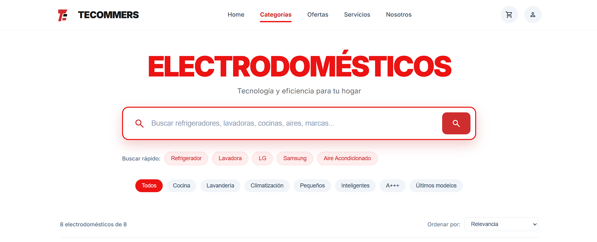
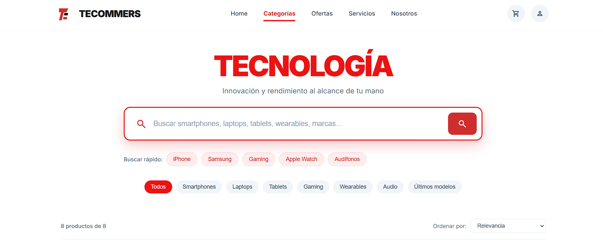
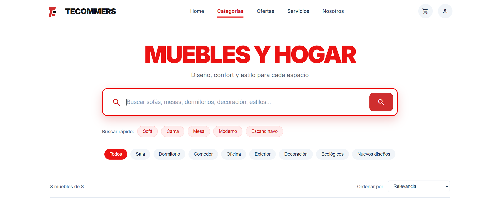

# Motores de Búsqueda

# **Sistema de Búsqueda - Herramientas**

## **¿QUÉ SE PUEDE BUSCAR?**

#### **1. Tipos de Herramientas**
- Taladros, sierras, llaves, pistolas de calor, cortadoras de césped, niveles láser
- Nombres completos como: "Taladro Percutor Bosch GBH 2-28"

#### **2. Marcas Especializadas**
- Bosch, Makita, DEWALT, Stanley, Husqvarna, 3M, Black+Decker, Werner
- Búsqueda directa o desde enlaces del footer

#### **3. Características Técnicas**
- Potencia: "850W", "1200W", "2000W"
- Especificaciones: "185mm", "46cm corte", "30m alcance"
- Materiales: "cromo-vanadio", "aluminio"
- Certificaciones: "CE", "profesional"

#### **4. Categorías de Herramientas**
- Eléctricas, Manuales, Jardinería
- Medición, Seguridad, Profesionales, Novedades

## **FILTROS DISPONIBLES**

#### **Categorías Principales:**
- Todas / Eléctricas / Manuales / Jardinería
- Medición / Seguridad / Profesionales / Novedades

#### **Filtros Especializados:**
- Profesionales (uso intensivo, garantía extendida)
- Novedades 2024 (últimos modelos con tecnología avanzada)
- Por potencia (ordenamiento por watts)
- Por descuento (% de reducción)

## **¿CÓMO FUNCIONA?**

#### **Búsqueda Rápida:**
- Botones de sugerencia: "Taladro", "Bosch", "Sierra", "Makita", "Jardinería"
- Filtros rápidos por categoría con activación visual

#### **Búsqueda por Texto:**
- Buscador principal con placeholder específico para herramientas
- Búsqueda en nombres, descripciones, marcas, modelos y potencia
- Resaltado de términos coincidentes en amarillo

#### **Filtros Inteligentes:**
- Combinación de texto + categorías
- Filtros desde footer categorías y marcas
- Filtro "profesional" detecta productos con categoría profesional
- Filtro "novedades" detecta productos del año 2024

#### **Ordenamiento Especializado:**
- Por relevancia (coincidencia con búsqueda)
- Por precio (ascendente/descendente)
- Por potencia (watts - mayor a menor)
- Por marca (orden alfabético)
- Por descuento (% de descuento mayor primero)
- Por novedad (año más reciente primero)

## **FUNCIONES ESPECIALES**

#### **Para Herramientas:**
- **Cálculo de potencia:** Convierte "850W" a valores numéricos para ordenamiento
- **Información profesional:** Modal con características de herramientas profesionales
- **Información novedades:** Modal destacando herramientas 2024
- **Especificaciones técnicas:** Badges con iconos para potencia, tamaño, características

#### **Experiencia Mejorada:**
- **Debounce en búsqueda:** 300ms para optimizar rendimiento
- **Notificaciones visuales:** Feedback inmediato de acciones
- **Scroll suave:** Al aplicar filtros desde footer
- **Focus automático:** Al cargar la página

## **INTERACCIÓN VISUAL**

- **Badges de especificaciones:** Rojo con texto blanco, iconos integrados
- **Efectos de hover:** En botones y tarjetas de producto
- **Modal informativo:** Para filtros especiales (profesionales, novedades)
- **Resaltado dinámico:** Términos de búsqueda en productos
- **Contador de carrito:** Incremento visual al agregar productos
- **Notificaciones:** Posicionadas para no interferir con contenido

## **ESTRUCTURA DE DATOS**

#### **Atributos de Producto:**
- `data-category`: Categorías múltiples separadas por espacios
- `data-brand`: Marca del producto
- `data-power`: Potencia en watts (ej: "850W")
- `data-model`: Modelo específico (ej: "GBH 2-28")
- `data-year`: Año del modelo (ej: "2024")
- `data-pieces`: Cantidad de piezas (ej: "32")
- `data-material`: Material de construcción

#### **Clase JavaScript:**
- `ToolsSearchSystem`: Maneja toda la lógica de búsqueda
- `filterProducts()`: Filtra por texto y categoría
- `sortProducts()`: Ordena por 7 criterios diferentes
- `parsePower()`: Convierte texto de potencia a número
- `getDiscountPercentage()`: Calcula % de descuento

## **EXPERIENCIA DEL USUARIO**

1. **Enfoque inmediato:** Campo de búsqueda enfocado al cargar
2. **Sugerencias contextuales:** Términos comunes de herramientas
3. **Filtros visibles:** 8 categorías principales accesibles
4. **Resultados claros:** Contador + especificaciones técnicas
5. **Feedback visual:** Notificaciones para búsquedas y agregado al carrito
6. **Reinicio fácil:** Botón "Mostrar todas" para limpiar filtros

## **RESUMEN TÉCNICO BREVE**

- **Búsqueda multifacética:** Texto, categorías, marcas, especificaciones
- **Ordenamiento especializado:** 7 criterios incluyendo potencia y descuento
- **Filtros inteligentes:** Detección de "profesionales" y "novedades"
- **Sistema de notificaciones:** Para búsquedas y acciones del usuario
- **Optimización de rendimiento:** Debounce en búsqueda en tiempo real
- **Accesibilidad múltiple:** Buscador, botones rápidos, footer links

**El sistema permite encontrar herramientas específicas por tipo, marca, potencia y características especiales, con énfasis en herramientas profesionales y novedades técnicas.**

## **Sistema de Búsqueda - Electrodomésticos**

### **¿QUÉ SE PUEDE BUSCAR?**

#### **1. Nombres de Productos**
- Refrigeradores, lavadoras, taladros, sofás
- Nombres completos como aparecen en pantalla

#### **2. Marcas**
- LG, Samsung, Bosch, Makita, Mabe, etc.
- Tanto en buscador como en clics del footer

#### **3. Características Principales**
- Tipo: "cocina", "jardinería", "oficina"
- Tecnología: "inteligente", "WiFi", "inducción"
- Especificaciones: "A+++", "18kg", "850W"

#### **4. Categorías Generales**
- Electrodomésticos: cocina, lavandería, climatización
- Herramientas: eléctricas, manuales, jardinería
- Muebles: sala, dormitorio, comedor, exterior

## **FILTROS DISPONIBLES**

#### **Electrodomésticos:**
- Todos / Cocina / Lavandería / Climatización
- Pequeños / Inteligentes / A+++ (eficiencia) / Últimos modelos

#### **Herramientas:**
- Todas / Eléctricas / Manuales / Jardinería
- Medición / Seguridad / Profesionales / Novedades

#### **Muebles:**
- Todos / Sala / Dormitorio / Comedor
- Oficina / Exterior / Decoración / Ecológicos / Nuevos diseños

## **¿CÓMO FUNCIONA?**

#### **Búsqueda Rápida (Botones):**
- Click en "Refrigerador", "Taladro", "Sofá"
- Búsqueda instantánea sin escribir

#### **Búsqueda por Texto:**
- Escribe en el buscador principal
- Encuentra por nombre, marca o características
- Resultados en tiempo real

#### **Filtros Rápidos:**
- Click en categorías específicas
- Filtra todos los productos de esa categoría

#### **Ordenamiento:**
- Por precio (más barato/más caro)
- Por características (eficiencia, potencia, novedad)
- Por marca (orden alfabético)
- Por relevancia (lo que más se parece a tu búsqueda)

## **FUNCIONES ESPECIALES**

#### **Para Electrodomésticos:**
- Filtro A+++: solo productos de máxima eficiencia
- Últimos modelos: productos 2024

#### **Para Herramientas:**
- Profesionales: herramientas de alta gama
- Novedades: herramientas 2024

#### **Para Muebles:**
- Ecológicos: muebles sostenibles
- Nuevos diseños: tendencias 2024

## **EXPERIENCIA DEL USUARIO**

1. **Encuentra rápido:** Botones de búsqueda rápida
2. **Filtra fácil:** Categorías claras y específicas
3. **Ordena como quieras:** Por precio, características o novedad
4. **Resultados claros:** Contador de productos encontrados
5. **Sin resultados?:** Mensaje amigable y opción para ver todo

## **RESUMEN TÉCNICO BREVE**

- **Búsqueda en tiempo real:** Filtra mientras escribes
- **Contenido indexado:** Nombres, marcas, características principales
- **Filtros inteligentes:** Por categoría, características especiales y año
- **Ordenamiento flexible:** 6-7 formas de ordenar según categoría
- **Interfaz simple:** Todo visible y accesible en un vistazo

**El sistema ayuda a encontrar exactamente lo que buscas en 3 clics o menos.**

# **Sistema de Búsqueda - Tecnología**

## **¿QUÉ SE PUEDE BUSCAR?**

#### **1. Productos Tecnológicos**
- Smartphones, laptops, tablets, wearables, dispositivos gaming, audio
- Nombres completos como: "iPhone 17 Pro Max", "MacBook Pro M3 Max"

#### **2. Marcas Principales**
- Apple, Samsung, Google, Sony, ASUS, Meta, etc.
- Búsqueda directa o desde enlaces del footer

#### **3. Características Técnicas**
- Procesadores: "A18 Pro", "Tensor G3", "M3 Max", "Snapdragon"
- Especificaciones: "1TB", "32GB RAM", "48MP", "RTX 4080"
- Tecnología: "AMOLED 120Hz", "Noise Cancelling", "Mixed Reality"

#### **4. Categorías Tecnológicas**
- Smartphones, Laptops, Tablets, Gaming
- Wearables, Audio, Últimos modelos

## **FILTROS DISPONIBLES**

#### **Categorías Principales:**
- Todos / Smartphones / Laptops / Tablets
- Gaming / Wearables / Audio / Últimos modelos

#### **Filtros Especiales:**
- Últimos modelos (productos 2024)
- Gaming (hardware especializado)
- Por rendimiento (basado en especificaciones)

## **¿CÓMO FUNCIONA?**

#### **Búsqueda Rápida:**
- Botones de sugerencia: "iPhone", "Samsung", "Gaming", etc.
- Filtros rápidos por categoría con un clic

#### **Búsqueda por Texto:**
- Buscador principal con sugerencias en tiempo real
- Búsqueda en nombres, descripciones, marcas y especificaciones
- Resaltado de términos coincidentes

#### **Filtros Inteligentes:**
- Combinación de texto + categorías
- Filtros activables desde el footer
- Sistema de "etiquetas" en productos (data attributes)

#### **Ordenamiento Avanzado:**
- Por relevancia (coincidencia con búsqueda)
- Por precio (ascendente/descendente)
- Por rendimiento (puntuación basada en especificaciones)
- Por almacenamiento (GB/TB)
- Por novedad (más recientes primero)
- Por marca (orden alfabético)

## **FUNCIONES ESPECIALES**

#### **Para Tecnología:**
- **Puntuación de rendimiento:** Sistema que calcula valor basado en procesador, RAM, almacenamiento
- **Últimos modelos:** Filtro especial con información destacada
- **Gaming profesional:** Información específica para hardware gaming

#### **Experiencia Mejorada:**
- **Debounce en búsqueda:** Evita múltiples ejecuciones
- **Notificaciones visuales:** Feedback inmediato de acciones
- **Scroll suave:** Navegación fluida al aplicar filtros

## **EXPERIENCIA DEL USUARIO**

1. **Búsqueda inmediata:** Campo enfocado automáticamente
2. **Múltiples accesos:** Buscador, botones rápidos, footer
3. **Resultados en tiempo real:** Filtrado mientras escribes
4. **Información clara:** Contador de productos + especificaciones técnicas
5. **Sin resultados?:** Mensaje amigable + opción para reiniciar

## **INTERACCIÓN VISUAL**

- **Efectos de hover:** En botones y tarjetas
- **Notificaciones:** Para agregar al carrito y búsquedas
- **Resaltado:** Términos coincidentes en amarillo
- **Animaciones:** Transiciones suaves en filtros
- **Feedback táctil:** Efectos al hacer clic en botones

## **RESUMEN TÉCNICO BREVE**

- **Clase JavaScript:** `TechnologySearchSystem` con métodos específicos
- **Búsqueda en tiempo real:** Con debounce de 300ms
- **Algoritmo de ordenamiento:** 7 criterios diferentes
- **Sistema de puntuación:** Calcula rendimiento basado en specs
- **Data attributes:** Productos etiquetados con categorías y especificaciones
- **Event delegation:** Para botones dinámicos y enlaces del footer
- **CSS dinámico:** Estilos en línea para notificaciones y efectos

**El sistema permite encontrar productos tecnológicos en segundos, con filtrado inteligente por especificaciones técnicas y categorías especializadas.**

# **Sistema de Búsqueda - Muebles y Hogar**

## **¿QUÉ SE PUEDE BUSCAR?**

#### **1. Tipos de Muebles**
- Sofás, camas, mesas, escritorios, muebles de terraza, alfombras, lámparas
- Nombres completos como: "Sofá Seccional Moderno", "Cama King Size Roble"

#### **2. Estilos de Diseño**
- Moderno, Escandinavo, Industrial, Rústico, Minimalista, Persa
- Filtros específicos por estilo desde el footer

#### **3. Características del Producto**
- Materiales: "madera", "tela", "vidrio", "metal", "MDF", "rattan", "lana"
- Especificaciones: "5 plazas", "king size", "3x2 metros", "ajustable"
- Características especiales: "modular", "extensible", "resistentes a la intemperie"

#### **4. Categorías por Habitación**
- Sala, Dormitorio, Comedor, Oficina, Exterior, Decoración

## **FILTROS DISPONIBLES**

#### **Categorías por Habitación:**
- Todos / Sala / Dormitorio / Comedor / Oficina / Exterior / Decoración

#### **Filtros Especiales:**
- Ecológicos (materiales sostenibles)
- Nuevos diseños (modelos 2024)
- Por calidad de material (sistema de valoración)
- Por estilo de diseño (desde footer especializado)

#### **Filtros de Estilo:**
- Moderno, Escandinavo, Industrial, Rústico, Minimalista, Persa
- Accesibles desde sección específica del footer

## **¿CÓMO FUNCIONA?**

#### **Búsqueda Rápida:**
- Botones de sugerencia: "Sofá", "Cama", "Mesa", "Moderno", "Escandinavo"
- 9 filtros rápidos por categoría de habitación y especiales

#### **Búsqueda por Texto:**
- Buscador principal específico para muebles y estilos
- Búsqueda en nombres, descripciones, materiales y estilos
- Resaltado visual de términos coincidentes

#### **Filtros Inteligentes:**
- Combinación de texto + categorías de habitación
- Filtro "ecológicos" detecta materiales sostenibles
- Filtro "nuevos diseños" detecta modelos 2024
- Sistema de valoración de materiales para ordenamiento

#### **Ordenamiento Especializado:**
- Por relevancia (coincidencia con búsqueda)
- Por precio (ascendente/descendente)
- Por popularidad (basado en % de descuento)
- Por novedad (modelos más recientes)
- Por calidad de material (sistema de valoración)
- Por estilo (orden alfabético)

## **FUNCIONES ESPECIALES**

#### **Para Muebles y Hogar:**
- **Sistema de valoración de materiales:** Asigna valores a madera, lana, vidrio, etc.
- **Filtro de estilos:** Desde footer con notificación especial
- **Información ecológica:** Modal con características de sostenibilidad
- **Información nuevos diseños:** Modal destacando tendencias 2024
- **Badges por característica:** Con iconos específicos para muebles

#### **Características Únicas:**
- **Armado profesional incluido:** Indicado en etiqueta de precio
- **Filtro por estilo desde footer:** Interfaz especializada para diseño
- **Notificación de estilo:** Feedback al seleccionar un estilo específico
- **Sistema de traducción de estilos:** Convierte códigos a nombres legibles

## **ESTRUCTURA DE DATOS**

#### **Atributos de Producto:**
- `data-category`: Categorías múltiples separadas por espacios
- `data-material`: Material principal de construcción
- `data-style`: Estilo de diseño (moderno, rústico, etc.)
- `data-model`: Año del modelo (ej: "2024")
- `data-seats`: Capacidad (ej: "5")
- `data-size`: Tamaño (ej: "king", "3x2m")

#### **Clase JavaScript:**
- `FurnitureSearchSystem`: Maneja toda la lógica de búsqueda
- `getMaterialValue()`: Sistema de valoración de materiales
- `getStyleName()`: Traducción de códigos de estilo a nombres
- `filterByStyle()`: Filtrado especializado por estilo
- `showStyleNotification()`: Feedback visual para filtros de estilo

## **SISTEMA DE VALORACIÓN**

#### **Materiales (de mayor a menor valor):**
1. **Madera/Roble:** 5 puntos (calidad superior)
2. **Lana:** 5 puntos (natural, premium)
3. **Tela/Rattan:** 4 puntos (buena calidad)
4. **Vidrio/Metal:** 4 puntos (duradero)
5. **MDF/MDP:** 3 puntos (económico)

#### **Criterios de Ordenamiento:**
- **Material:** Prioriza materiales de mayor calidad
- **Popularidad:** Basado en % de descuento
- **Novedad:** Modelos más recientes primero
- **Estilo:** Orden alfabético por nombre de estilo

## **INTERACCIÓN VISUAL**

- **Badges de especificaciones:** Rojo con iconos específicos para muebles
- **Modal ecológico:** Verde para destacar sostenibilidad
- **Notificación de estilo:** Para feedback de filtros por diseño
- **Iconos temáticos:** Sillón para no resultados, paleta para estilos
- **Etiqueta de armado:** Verde en precios para servicio incluido

## **EXPERIENCIA DEL USUARIO**

1. **Búsqueda contextual:** Placeholder específico para muebles
2. **Filtros por estilo:** Sección especializada en footer
3. **Información de servicios:** Armado profesional destacado
4. **Valoración visual:** Badges con características clave
5. **Feedback especializado:** Notificaciones por estilo y ecología
6. **Navegación por habitaciones:** Filtros organizados por espacios del hogar

## **RESUMEN TÉCNICO BREVE**

- **Búsqueda por estilo:** Sistema especializado para diseño de interiores
- **Valoración de materiales:** Algoritmo para ordenar por calidad
- **Filtros ecológicos:** Detección inteligente de materiales sostenibles
- **Notificaciones temáticas:** Específicas para acciones de muebles
- **Sistema de traducción:** Códigos de estilo a nombres legibles
- **Footer especializado:** Sección independiente para filtros por estilo

**El sistema permite encontrar muebles por habitación, estilo, material y características especiales, con énfasis en diseño, calidad de materiales y opciones sostenibles para el hogar.**

