# **Pruebas Registro Tecommers**

# **Pruebas en el campo Nombre**

## **Validación de Nombre (Campo vacío)**

**Tipo de prueba:** campo vacío.
**Mensaje de error feedback:** "El nombre completo es obligatorio".
**feedback estático:** "Mínimo 3 caracteres".

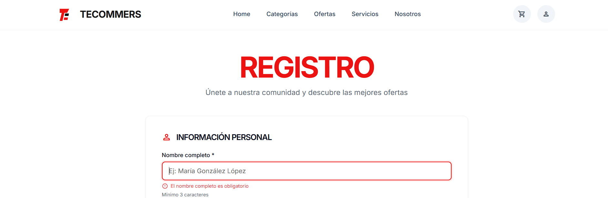

## **Validación de Nombre (Campo incompleto)**

**Tipo de prueba:** campo incompleto (menos de 3 caracteres).
**Mensaje de error feedback:** "El nombre completo debe de tener minimo 3 caracteres".
**feedback estático:** "Mínimo 3 caracteres".

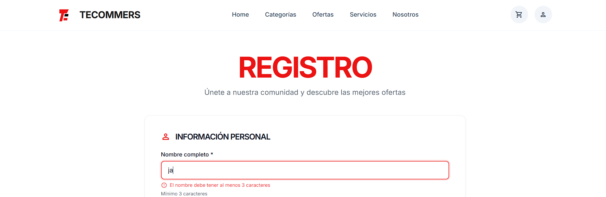

## **Validación de Nombre (Campo con números)**

**Tipo de prueba:** campo inválido (contiene numeros).
**Mensaje de error feedback:** "El nombre no puede contener números".
**feedback estático:** "Mínimo 3 caracteres".

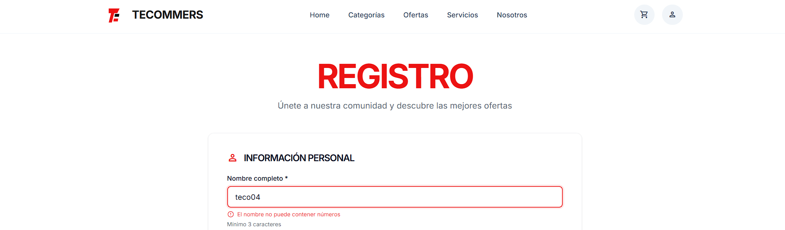

## **Validación de Nombre (Campo con caracteres especiales)**

**Tipo de prueba:** campo inválido (contiene caracteres especiales).
**Mensaje de error feedback:** "El nombre solo puede contener letras y espacios".
**feedback estático:** "Mínimo 3 caracteres".

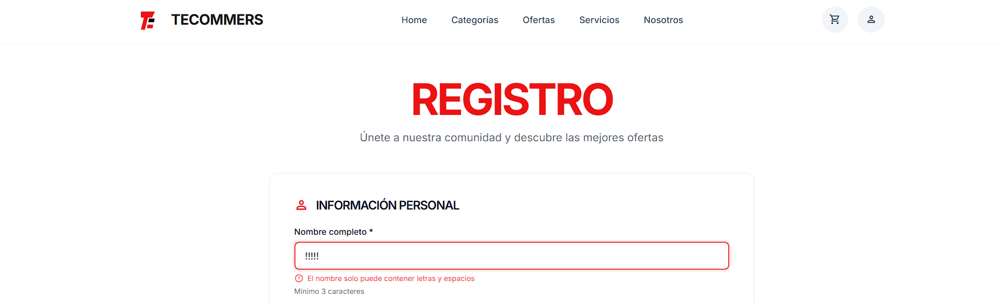   

## **Validación de Nombre (Campo sin almenos un espacio)**

**Tipo de prueba:** campo inválido (el campo de nombre solo tiene texto pero no un espacio, esto nos asegura que al menos tenfga un nombre y un apellido).
**Mensaje de error feedback:** "Por favor , ingresa nombre y apellido".
**feedback estático:** "Mínimo 3 caracteres".

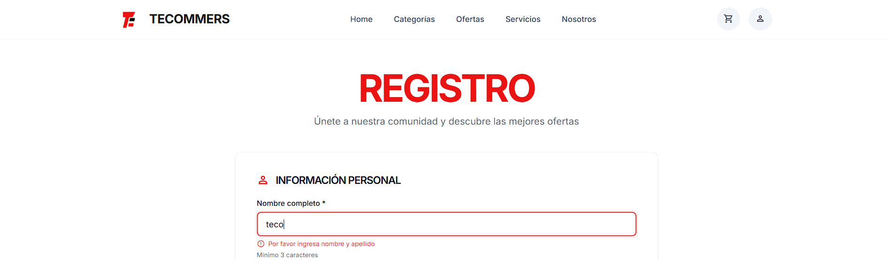   

## **Validación de Nombre (Campo válido)**

**Tipo de prueba:** campo válido (más de 3 caracteres, al menos un espacio, sin numeros, si caracteres especiales y menos de 50 caracteres).
**Mensaje de error feedback:** No hay mensaje de error feedback, el borde del campo se pone en verde.
**feedback estático:** "Mínimo 3 caracteres".

## **Validación de Nombre (Campo válido 50 caracteres)**

**Tipo de prueba:** máximo de caracteres (poner 50 caracteres, con al menos un espacio).

**Nota:** El sistema automáticamente ya no deja poner más de 50 caracteres aunque lo intentes.

# **Pruebas en el campo de correo electronico**

## **Validación de Correo (Campo vacío)**

**Tipo de prueba:** campo vacío.
**Mensaje de error feedback:** "El correo electronico es obligatorio".
**feedback estático:** "Usaremos este correo para notificaciones".

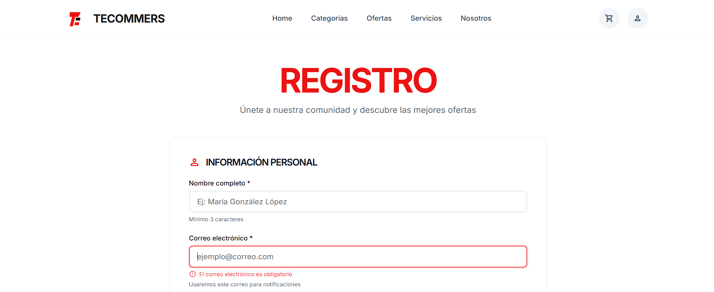

## **Validación de Correo (Formato inválido)**

**Tipo de prueba:** El formato ingresado en el campo es incorrecto (solo tiene el dominio).
**Mensaje de error feedback:** "ingresa un correo electronico válido (ejemplo@gmail.com)".
**feedback estático:** "Usaremos este correo para notificaciones".

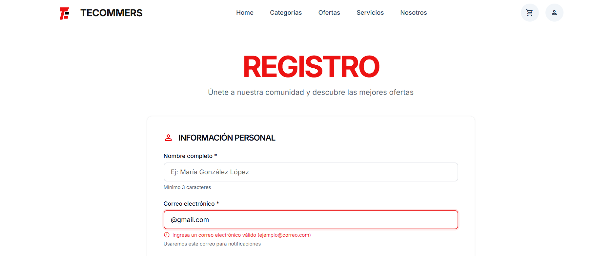

## **Validación de Correo (Formato inválido)**

**Tipo de prueba:** El formato ingresado en el campo es incorrecto (tiene que tener el dominio).
**Mensaje de error feedback:** "ingresa un correo electronico válido (ejemplo@gmail.com)".
**feedback estático:** "Usaremos este correo para notificaciones".

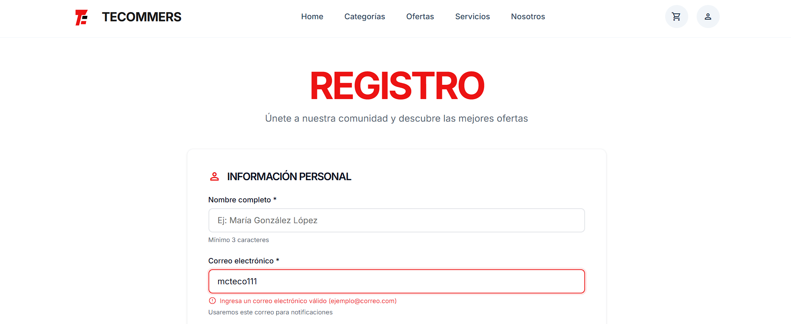

## **Validación de Correo (Formato inválido)**

**Tipo de prueba:** El formato ingresado en el campo es incorrecto (tiene que tener @).
**Mensaje de error feedback:** "ingresa un correo electronico válido (ejemplo@gmail.com)".
**feedback estático:** "Usaremos este correo para notificaciones".

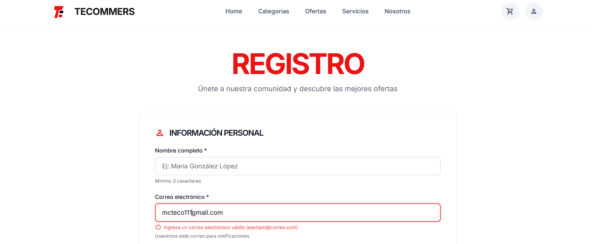

## **Validación de Correo (Formato inválido)**

**Tipo de prueba:** El formato ingresado en el campo es incorrecto (tiene que tener al menos un punto).
**Mensaje de error feedback:** "ingresa un correo electronico válido (ejemplo@gmail.com)".
**feedback estático:** "Usaremos este correo para notificaciones".

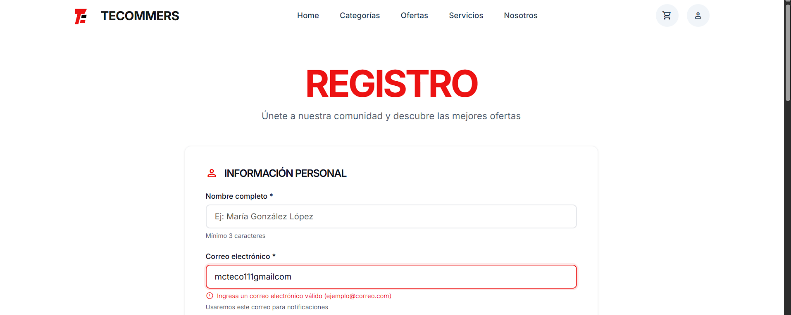

## **Validación de Correo (Formato inválido)**

**Tipo de prueba:** El formato ingresado en el campo es incorrecto (no tiene que tener espacios).
**Mensaje de error feedback:** "ingresa un correo electronico válido (ejemplo@gmail.com)".
**feedback estático:** "Usaremos este correo para notificaciones".

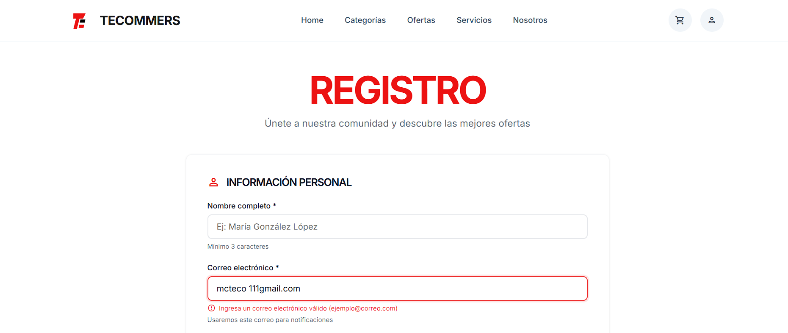

# **Pruebas en el campo de Teléfono**

## **Validación de teléfono (Campo vacío)**

**Tipo de prueba:** campo vacío.
**Mensaje de error feedback:** "El telefono es obligatorio".
**feedback estático:** "10 digitos sin espacios".

## **Validación de teléfono (no tiene 10 digitos)**

**Tipo de prueba:** El campo no esta relleno con 10 digitos.
**Mensaje de error feedback:** "El teléfono debe tener exactamente 10 dígitos".
**feedback estático:** "10 digitos sin espacios".

## **Validación de teléfono (tiene más de 10 digitos)**

**Tipo de prueba:** El campo está relleno con más de 10 digitos.
**Mensaje de error feedback:** "El teléfono debe tener exactamente 10 dígitos, por favor, ingresa un número que no tenga más de 10 dígitos".
**feedback estático:** "10 digitos sin espacios".

## **Validación de teléfono (el caampo tiene texto y no digitos)**

**Tipo de prueba:** El campo está relleno con texto y no con digitos.
**Mensaje de error feedback:** "Ingresa 10 dígitos, todos deben ser números y sin espacios".
**feedback estático:** "10 digitos sin espacios".

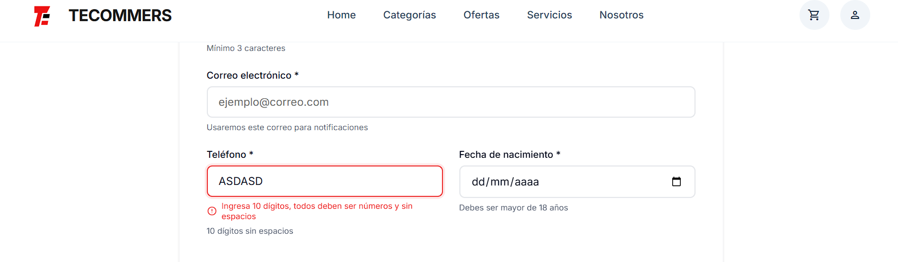

## **Validación de teléfono (Formato válido)**

**Tipo de prueba:** El campo está relleno exactamente con 10 digitos, sin espacios, sin letras.
**Mensaje de error feedback:** No hay mensaje de error feedback, el borde del campo se pone en verde.
**feedback estático:** "10 digitos sin espacios".

