# **Pruebas Registro Tecommers**

# **Pruebas en el campo Nombre**

## **Validación de Nombre (Campo vacío)**

**Tipo de prueba:** campo vacío.
**Mensaje de error feedback:** "El nombre completo es obligatorio".
**feedback estático:** "Mínimo 3 caracteres".

## **Validación de Nombre (Campo incompleto)**

**Tipo de prueba:** campo incompleto (menos de 3 caracteres).
**Mensaje de error feedback:** "El nombre completo debe de tener minimo 3 caracteres".
**feedback estático:** "Mínimo 3 caracteres".

## **Validación de Nombre (Campo con números)**

**Tipo de prueba:** campo inválido (contiene numeros).
**Mensaje de error feedback:** "El nombre no puede contener números".
**feedback estático:** "Mínimo 3 caracteres".

## **Validación de Nombre (Campo con caracteres especiales)**

**Tipo de prueba:** campo inválido (contiene caracteres especiales).
**Mensaje de error feedback:** "El nombre solo puede contener letras y espacios".
**feedback estático:** "Mínimo 3 caracteres".

   

## **Validación de Nombre (Campo sin almenos un espacio)**

**Tipo de prueba:** campo inválido (el campo de nombre solo tiene texto pero no un espacio, esto nos asegura que al menos tenfga un nombre y un apellido).
**Mensaje de error feedback:** "Por favor , ingresa nombre y apellido".
**feedback estático:** "Mínimo 3 caracteres".

   

## **Validación de Nombre (Campo válido)**

**Tipo de prueba:** campo válido (más de 3 caracteres, al menos un espacio, sin numeros, si caracteres especiales y menos de 50 caracteres).
**Mensaje de error feedback:** No hay mensaje de error feedback, el borde del campo se pone en verde.
**feedback estático:** "Mínimo 3 caracteres".

## **Validación de Nombre (Campo válido 50 caracteres)**

**Tipo de prueba:** máximo de caracteres (poner 50 caracteres, con al menos un espacio).

**Nota:** El sistema automáticamente ya no deja poner más de 50 caracteres aunque lo intentes.

# **Pruebas en el campo de correo electronico**

## **Validación de Correo (Campo vacío)**

**Tipo de prueba:** campo vacío.
**Mensaje de error feedback:** "El correo electronico es obligatorio".
**feedback estático:** "Usaremos este correo para notificaciones".

## **Validación de Correo (Formato inválido)**

**Tipo de prueba:** El formato ingresado en el campo es incorrecto (solo tiene el dominio).
**Mensaje de error feedback:** "ingresa un correo electronico válido (ejemplo@gmail.com)".
**feedback estático:** "Usaremos este correo para notificaciones".

## **Validación de Correo (Formato inválido)**

**Tipo de prueba:** El formato ingresado en el campo es incorrecto (tiene que tener el dominio).
**Mensaje de error feedback:** "ingresa un correo electronico válido (ejemplo@gmail.com)".
**feedback estático:** "Usaremos este correo para notificaciones".

## **Validación de Correo (Formato inválido)**

**Tipo de prueba:** El formato ingresado en el campo es incorrecto (tiene que tener @).
**Mensaje de error feedback:** "ingresa un correo electronico válido (ejemplo@gmail.com)".
**feedback estático:** "Usaremos este correo para notificaciones".

## **Validación de Correo (Formato inválido)**

**Tipo de prueba:** El formato ingresado en el campo es incorrecto (tiene que tener al menos un punto).
**Mensaje de error feedback:** "ingresa un correo electronico válido (ejemplo@gmail.com)".
**feedback estático:** "Usaremos este correo para notificaciones".

## **Validación de Correo (Formato inválido)**

**Tipo de prueba:** El formato ingresado en el campo es incorrecto (no tiene que tener espacios).
**Mensaje de error feedback:** "ingresa un correo electronico válido (ejemplo@gmail.com)".
**feedback estático:** "Usaremos este correo para notificaciones".

# **Pruebas en el campo de Teléfono**

## **Validación de teléfono (Campo vacío)**

**Tipo de prueba:** campo vacío.
**Mensaje de error feedback:** "El telefono es obligatorio".
**feedback estático:** "10 digitos sin espacios".

## **Validación de teléfono (no tiene 10 digitos)**

**Tipo de prueba:** El campo no esta relleno con 10 digitos.
**Mensaje de error feedback:** "El teléfono debe tener exactamente 10 dígitos".
**feedback estático:** "10 digitos sin espacios".

## **Validación de teléfono (tiene más de 10 digitos)**

**Tipo de prueba:** El campo está relleno con más de 10 digitos.
**Mensaje de error feedback:** "El teléfono debe tener exactamente 10 dígitos, por favor, ingresa un número que no tenga más de 10 dígitos".
**feedback estático:** "10 digitos sin espacios".

## **Validación de teléfono (el caampo tiene texto y no digitos)**

**Tipo de prueba:** El campo está relleno con texto y no con digitos.
**Mensaje de error feedback:** "Ingresa 10 dígitos, todos deben ser números y sin espacios".
**feedback estático:** "10 digitos sin espacios".

## **Validación de teléfono (Formato válido)**

**Tipo de prueba:** El campo está relleno exactamente con 10 digitos, sin espacios, sin letras.
**Mensaje de error feedback:** No hay mensaje de error feedback, el borde del campo se pone en verde.
**feedback estático:** "10 digitos sin espacios".

# **Pruebas en el campo Fecha de Nacimiento**

## **Validación de Fecha de Nacimiento (Campo vacío)**

**Tipo de prueba:** campo vacío.
**Mensaje de error feedback:** "La fecha de nacimiento es obligatoria".
**feedback estático:** "Debes ser mayor de 18 años".

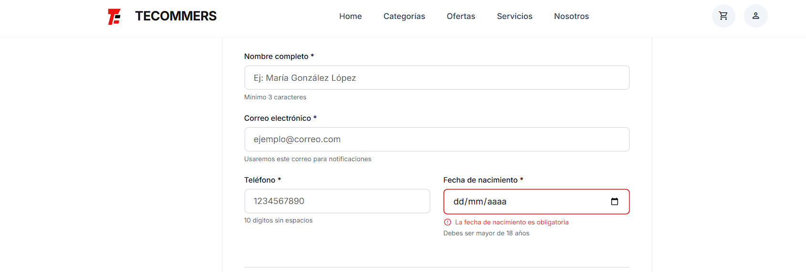

## **Validación de Fecha de Nacimiento (Menor de 18 años)**

**Tipo de prueba:** fecha que hace al usuario menor de 18 años.
**Mensaje de error feedback:** "Debes ser mayor de 18 años para registrarte".
**feedback estático:** "Debes ser mayor de 18 años".

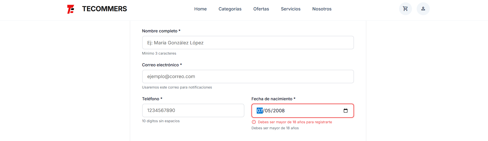

## **Validación de Fecha de Nacimiento (Fecha futura)**

**Tipo de prueba:** fecha en el futuro (no permitida por el navegador).
**Mensaje de error feedback:** El navegador muestra su propio calendariio de validación.
**feedback estático:** "Debes ser mayor de 18 años".

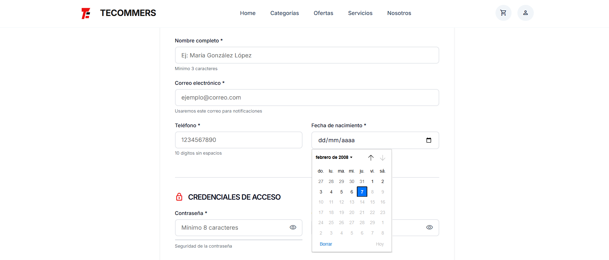

## **Validación de Fecha de Nacimiento (Fecha válida - exactamente 18 años)**

**Tipo de prueba:** fecha que hace al usuario exactamente 18 años.
**Mensaje de error feedback:** No hay mensaje de error feedback, el borde del campo se pone en verde.
**feedback estático:** "Debes ser mayor de 18 años".

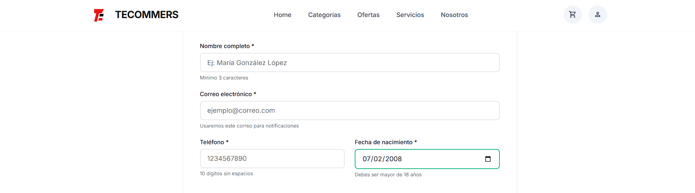

# **Pruebas en el campo Contraseña**

## **Validación de Contraseña (Campo vacío)**

**Tipo de prueba:** campo vacío.
**Mensaje de error feedback:** "La contraseña es obligatoria".
**feedback estático:** "Mínimo 8 caracteres".

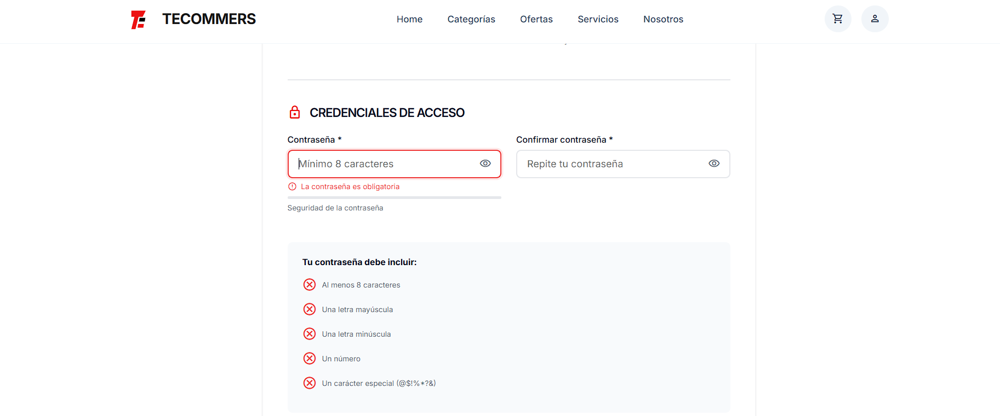

## **Validación de Contraseña (Menos de 8 caracteres)**

**Tipo de prueba:** contraseña con menos de 8 caracteres.
**Mensaje de error feedback:** "La contraseña debe tener al menos 8 caracteres".
**feedback estático:** "Mínimo 8 caracteres".

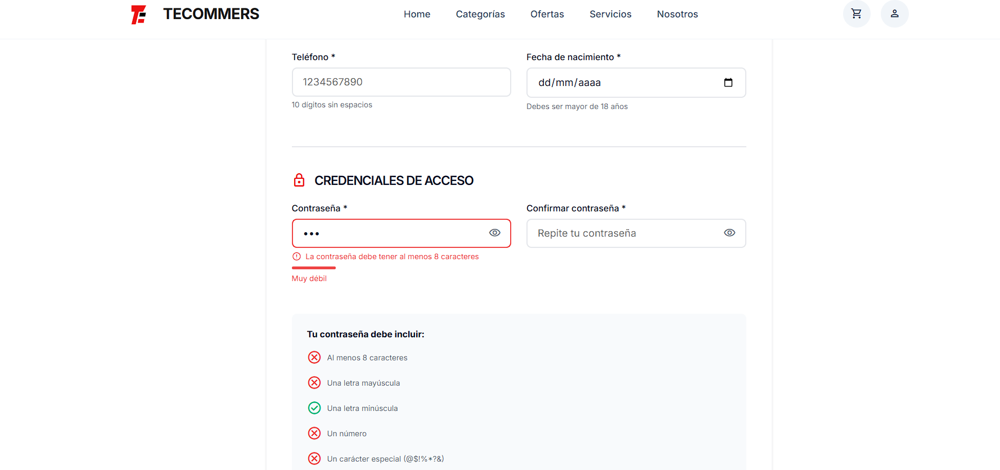

## **Validación de Contraseña (Sin letra mayúscula)**

**Tipo de prueba:** contraseña sin letra mayúscula.
**Mensaje de error feedback:** "Incluye al menos una letra mayúscula".
**feedback estático:** "Mínimo 8 caracteres".

**Ejemplo:** "abcdefg123!"

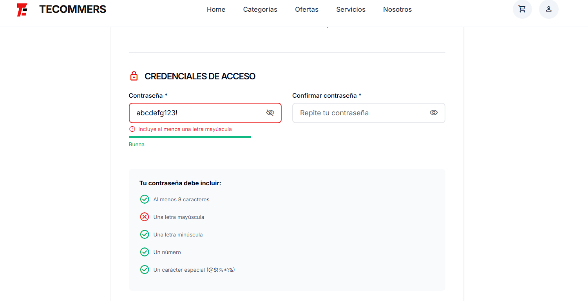

## **Validación de Contraseña (Sin letra minúscula)**

**Tipo de prueba:** contraseña sin letra minúscula.
**Mensaje de error feedback:** "Incluye al menos una letra minúscula".
**feedback estático:** "Mínimo 8 caracteres".

**Ejemplo:** "ABCDEFG123!"

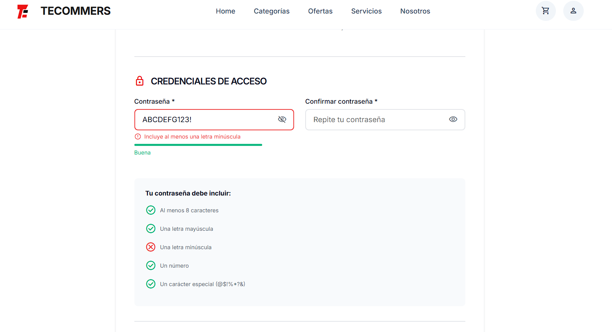

## **Validación de Contraseña (Sin número)**

**Tipo de prueba:** contraseña sin número.
**Mensaje de error feedback:** "Incluye al menos un número".
**feedback estático:** "Mínimo 8 caracteres".

**Ejemplo:** "Abcdefg@!"

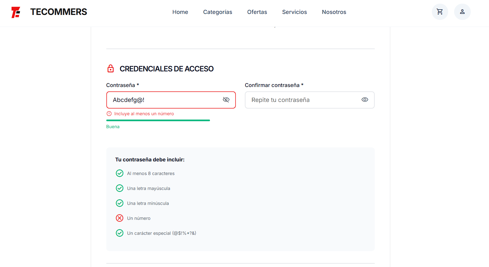

## **Validación de Contraseña (Sin carácter especial)**

**Tipo de prueba:** contraseña sin carácter especial.
**Mensaje de error feedback:** "Incluye al menos un carácter especial (@$!%*?&)".
**feedback estático:** "Mínimo 8 caracteres".

**Ejemplo:** "Abcdefg123"

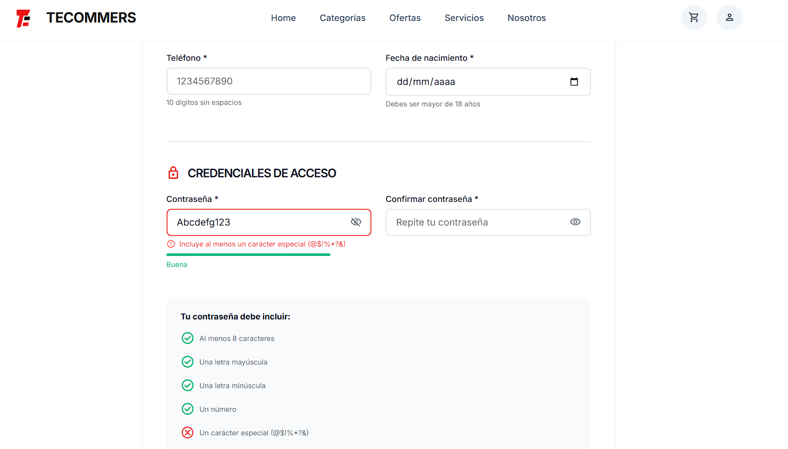

## **Validación de Contraseña (Contraseña válida)**

**Tipo de prueba:** contraseña que cumple todos los requisitos.
**Mensaje de error feedback:** No hay mensaje de error feedback, el borde del campo se pone en verde.
**feedback visual:** Todos los requisitos muestran icono de check verde.
**feedback estático:** "Mínimo 8 caracteres".

**Ejemplo:** "MiContraseña123!"

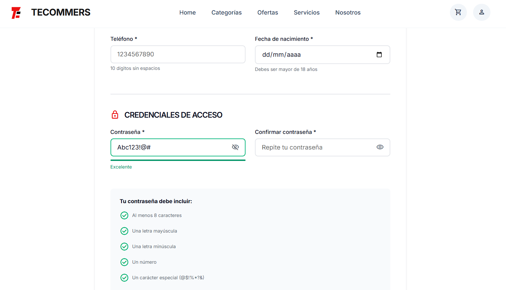

# **Pruebas en Confirmación de Contraseña**

## **Validación de Confirmación (Campo vacío)**

**Tipo de prueba:** campo de confirmación vacío.
**Mensaje de error feedback:** "Debes confirmar tu contraseña".
**feedback estático:** Campo sin feedback estático específico.

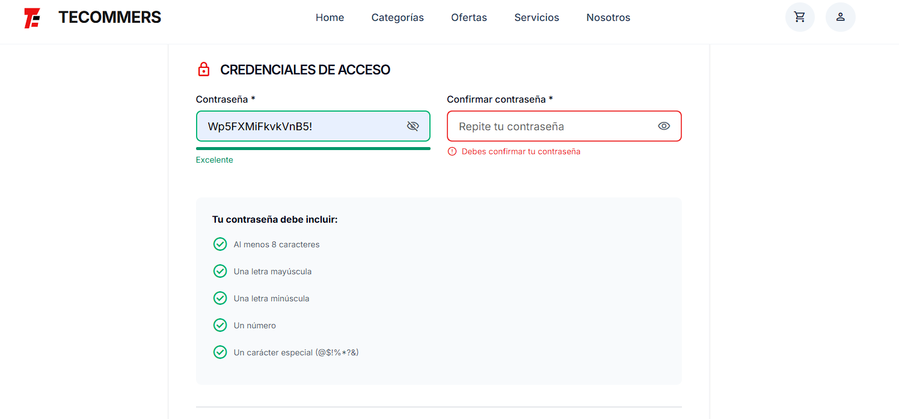

## **Validación de Confirmación (No coincide)**

**Tipo de prueba:** confirmación no coincide con la contraseña.
**Mensaje de error feedback:** "Las contraseñas no coinciden".
**feedback estático:** Campo sin feedback estático específico.

**Ejemplo:** Contraseña: "Wp5FXMiFkvkVnB5!", Confirmación: "jajajajaja"

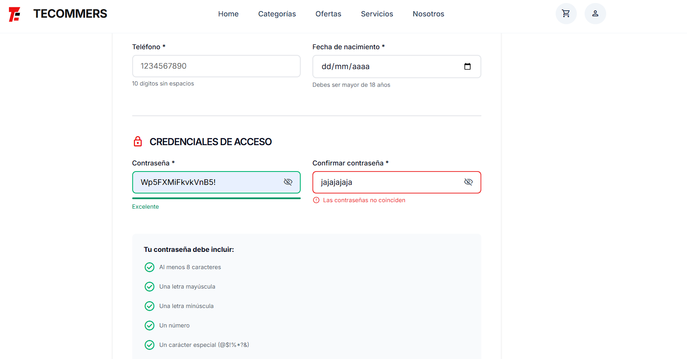

## **Validación de Confirmación (Coincide)**

**Tipo de prueba:** confirmación coincide exactamente con la contraseña.
**Mensaje de error feedback:** No hay mensaje de error feedback, el borde del campo se pone en verde.
**feedback estático:** Campo sin feedback estático específico.

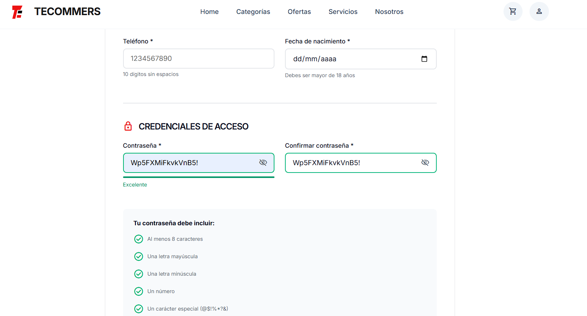

# **Pruebas en Validación Humana (CAPTCHA)**

## **Validación Humana (Campo vacío)**

**Tipo de prueba:** campo de respuesta vacío.
**Mensaje de error feedback:** "Debes responder la pregunta de seguridad".
**feedback estático:** "Pregunta simple para prevenir registros automáticos".

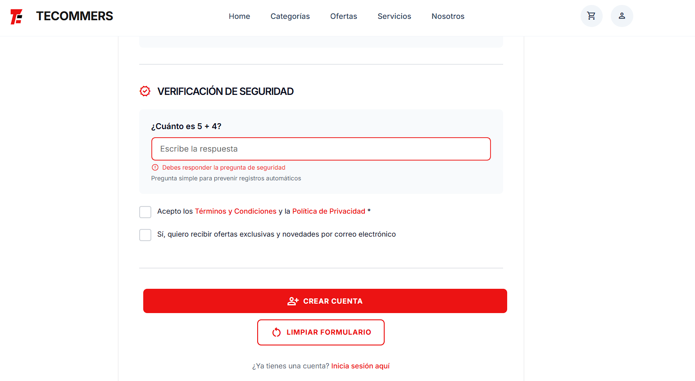   

## **Validación Humana (Respuesta incorrecta)**

**Tipo de prueba:** respuesta incorrecta a la pregunta de seguridad.
**Mensaje de error feedback:** "Respuesta incorrecta. Por favor, intenta nuevamente".
**feedback estático:** "Pregunta simple para prevenir registros automáticos".

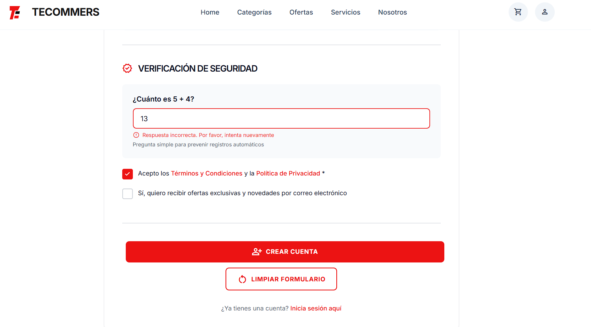

## **Validación Humana (Respuesta correcta - número)**

**Tipo de prueba:** respuesta correcta 12 en numero.
**Mensaje de error feedback:** No hay mensaje de error feedback, el borde del campo se pone en verde.
**feedback estático:** "Pregunta simple para prevenir registros automáticos".

**Ejemplo:** Pregunta: "¿Cuánto es 5 + 4?" → Respuesta: "9"

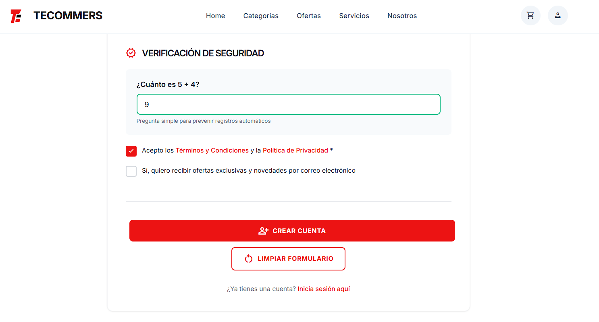

# **Pruebas en Términos y Condiciones**

## **Validación de Términos (No aceptados)**

**Tipo de prueba:** checkbox de términos no marcado.
**Mensaje de error feedback:** "Debes aceptar los términos y condiciones".
**feedback estático:** Checkbox con etiqueta clara.

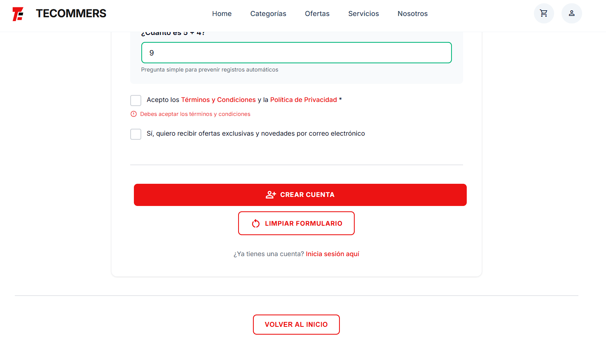

## **Validación de Términos (Aceptados)**

**Tipo de prueba:** checkbox de términos marcado.
**Mensaje de error feedback:** No hay mensaje de error feedback.
**feedback visual:** Checkbox marcado con check.

# **Pruebas de Integración (Envío del Formulario)**

## **Envío con campos incompletos**

**Tipo de prueba:** intentar enviar formulario con campos incompletos.
**Comportamiento:** 
- Se muestran todos los mensajes de error
- Scroll automático al primer campo con error
- Foco en el primer campo con error
- Botón de envío no se procesa

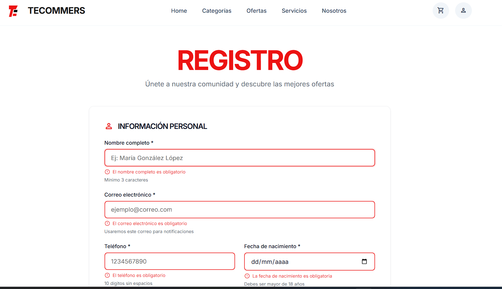
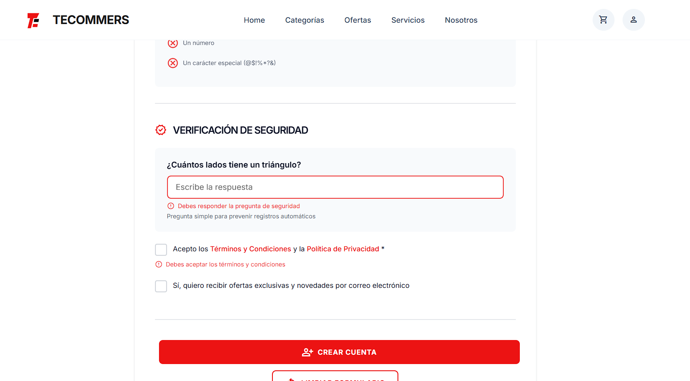
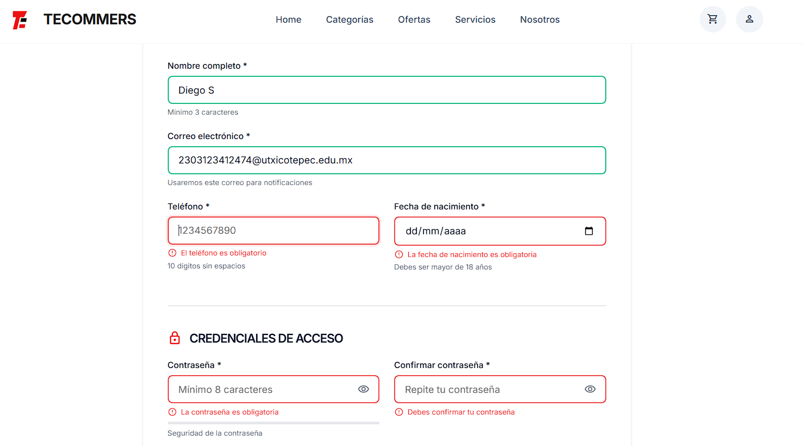

## **Envío con campos válidos**

**Tipo de prueba:** enviar formulario con todos los campos válidos.
**Comportamiento:**
- Modal de éxito se muestra
- Cuenta regresiva de 5 segundos
- Correo del usuario mostrado en el mensaje
- Opción de continuar inmediatamente

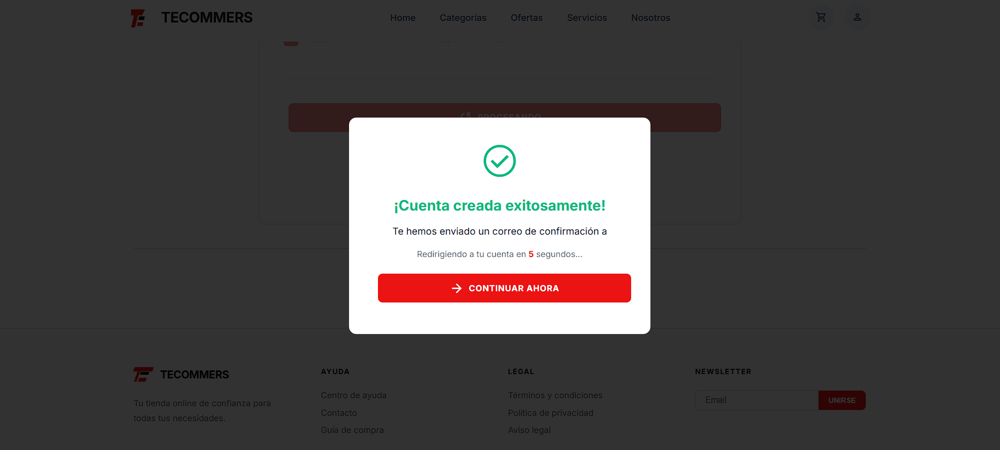

## **Reset del formulario**

**Tipo de prueba:** usar botón "Limpiar formulario".
**Comportamiento:**
- Todos los campos se vacían
- Todos los mensajes de error se ocultan
- Clases de validación se remueven
- Barra de fuerza de contraseña se reinicia
- Nueva pregunta de CAPTCHA generada
- Foco vuelve al campo de nombre

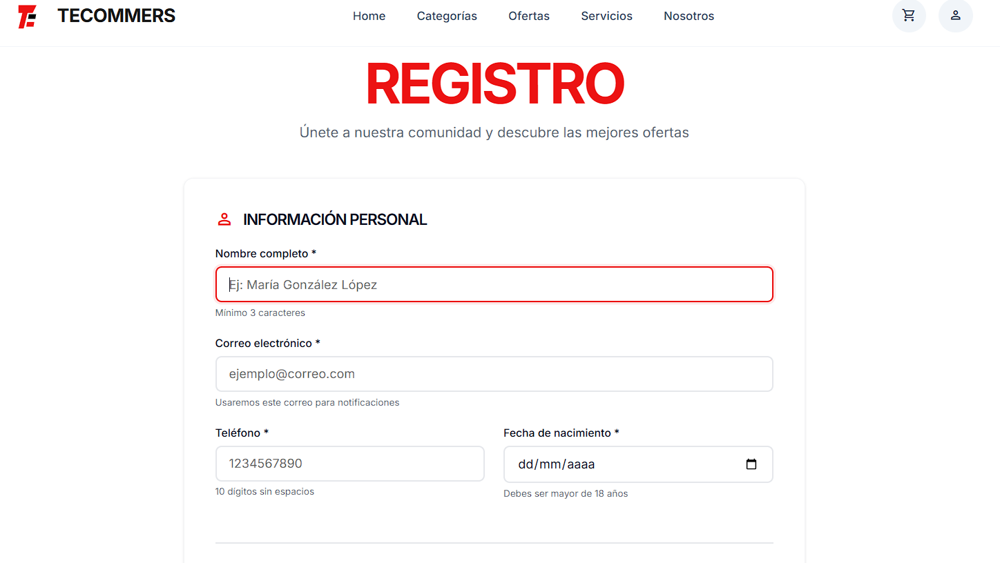